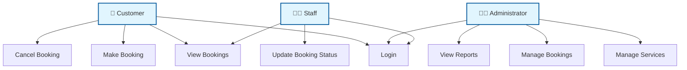

```mermaid
graph TB
    %% Actors
    Customer[👤 Customer]
    Admin[👨‍💼 Administrator]
    Staff[👨‍💻 Staff]
    
    %% Use Cases
    Login[Login]
    MakeBooking[Make Booking]
    ViewBookings[View Bookings]
    CancelBooking[Cancel Booking]
    ManageServices[Manage Services]
    ManageBookings[Manage Bookings]
    ViewReports[View Reports]
    UpdateBookingStatus[Update Booking Status]
    
    %% Relationships
    Customer --> Login
    Customer --> MakeBooking
    Customer --> ViewBookings
    Customer --> CancelBooking
    
    Admin --> Login
    Admin --> ManageServices
    Admin --> ManageBookings
    Admin --> ViewReports
    
    Staff --> Login
    Staff --> ViewBookings
    Staff --> UpdateBookingStatus
    
    %% Styling
    classDef actor fill:#e1f5fe,stroke:#01579b,stroke-width:2px
    classDef usecase fill:#f3e5f5,stroke:#4a148c,stroke-width:1px
    
    class Customer,Admin,Staff actor
```